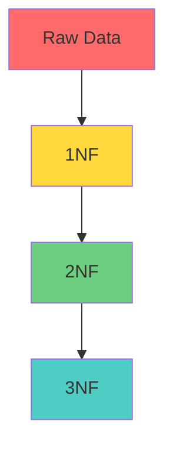
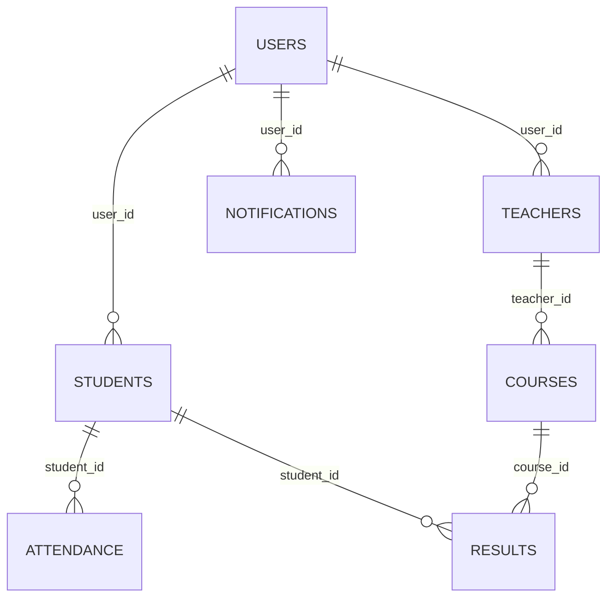

# 🎓 Coaching Management System

<div align="center">
  
  
  
  
  

  ### 🚀 A Complete Educational Management Solution
  
  *Streamlining coaching center operations with modern database architecture*

  **Developer**: MUDASIR NAEEM (mudasirnaeem000@gmail.com)
  
</div>

---

## 📋 Table of Contents

- [🎯 Project Overview](#-project-overview)
- [✨ Key Features](#-key-features)
- [📊 Database Schema](#-database-schema)
- [🔄 Normalization Journey](#-normalization-journey)
- [🛠️ Technology Stack](#️-technology-stack)
- [📱 User Roles](#-user-roles)
- [🚀 Getting Started](#-getting-started)

---

## 🎯 Project Overview

The **Coaching Management System** is a comprehensive educational management platform designed to streamline operations in coaching centers and educational institutions. Built with modern database principles and powered by Supabase, this system manages students, teachers, courses, attendance, results, and administrative tasks efficiently.

> 💡 **Built with Database Normalization in Mind** - Our system follows proper 3NF (Third Normal Form) principles for optimal data integrity and performance.

---

## ✨ Key Features

<div align="center">

| 🎓 **Student Management** | 👨‍🏫 **Teacher Management** | 📚 **Course Management** |
|:-------------------------:|:---------------------------:|:-------------------------:|
| Student Registration     | Teacher Profiles            | Course Creation           |
| Contact Information       | Subject Assignment          | Course Outlines           |
| Class Enrollment          | Teaching Schedules          | Exercise Tracking         |

| 📅 **Attendance System** | 📊 **Results Management** | 🔔 **Notifications** |
|:-------------------------:|:-------------------------:|:--------------------:|
| Daily Attendance          | Marks Recording           | Email Notifications  |
| Attendance Reports        | Grade Calculations        | System Alerts        |
| Status Tracking           | Performance Analytics     | Updates & Reminders  |

</div>

---

Our system implements a **3NF (Third Normal Form)** database structure ensuring:


- 1NF: Atomic Values

- 2NF: Remove Partial Dependencies

- 3NF: Remove Transitive Dependencies

### 🎯 Normalization Benefits:
- 🔒 **Data Integrity**: Eliminates redundancy and inconsistencies
- ⚡ **Performance**: Optimized queries and faster data retrieval
- 🔧 **Maintainability**: Easy updates and modifications
- 📈 **Scalability**: Efficient handling of growing data

---

## 📊 Database Schema

###  Core Tables Structure

<details>
<summary>👤 <strong>User Management Tables</strong></summary>

#### **Users Table**
| Column | Type | Description |
|--------|------|-------------|
| `user_id` (PK) | VARCHAR | Primary identifier |
| `user_name` | VARCHAR | Full name |
| `user_type` | VARCHAR | Student/Teacher/Admin |
| `password` | VARCHAR | Encrypted password |

#### **Students Table**
| Column | Type | Description |
|--------|------|-------------|
| `student_id` (PK) | VARCHAR | Student identifier |
| `student_name` | VARCHAR | Student full name |
| `father_name` | VARCHAR | Father's name |
| `contact_1` | VARCHAR | Primary contact |
| `contact_2` | VARCHAR | Secondary contact |
| `enrolled_class` | VARCHAR | Class enrolled in |
| `course_id` (FK) | VARCHAR | Associated course |

</details>

<details>
<summary>👨‍🏫 <strong>Academic Tables</strong></summary>

#### **Teachers Table**
| Column | Type | Description |
|--------|------|-------------|
| `teacher_id` (PK) | VARCHAR | Teacher identifier |
| `teacher_name` | VARCHAR | Teacher full name |
| `teaching_subject` | VARCHAR | Subject expertise |

#### **Courses Table**
| Column | Type | Description |
|--------|------|-------------|
| `course_id` (PK) | VARCHAR | Course identifier |
| `course_name` | VARCHAR | Course title |
| `teacher_id` (FK) | VARCHAR | Assigned teacher |
| `student_id` (FK) | VARCHAR | Enrolled student |

</details>

<details>
<summary>📅 <strong>Operational Tables</strong></summary>

#### **Attendance Table**
| Column | Type | Description |
|--------|------|-------------|
| `attendance_id` (PK) | VARCHAR | Attendance record ID |
| `attendance_date` | DATE | Date of attendance |
| `attendance_day` | VARCHAR | Day of week |
| `attendance_status` | VARCHAR | Present/Absent |
| `student_id` (FK) | VARCHAR | Student reference |

#### **Results Table**
| Column | Type | Description |
|--------|------|-------------|
| `result_id` (PK) | VARCHAR | Result identifier |
| `subject_name` | VARCHAR | Subject name |
| `class` | VARCHAR | Class level |
| `marks` | VARCHAR | Obtained marks |
| `percentage` | DECIMAL | Result percentage |
| `course_id` (FK) | VARCHAR | Course reference |

</details>

---

## 🔄 Normalization Journey

### 📊 Transformation Process

```
🔴 Raw Data (Unnormalized)
     ↓
🟡 First Normal Form (1NF)
   • Atomic values only
   • No repeating groups
     ↓
🟢 Second Normal Form (2NF)
   • Remove partial dependencies
   • Separate user and scheduling data
     ↓
🔵 Third Normal Form (3NF)
   • Remove transitive dependencies
   • Create specialized tables
```

### 📈 Before vs After Comparison

| Aspect | Before Normalization | After 3NF |
|--------|---------------------|-----------|
| **Tables** | 1 Large Table | 10 Specialized Tables |
| **Data Redundancy** | High | Eliminated |
| **Data Integrity** | Poor | Excellent |
| **Query Performance** | Slow | Optimized |
| **Maintenance** | Difficult | Easy |

---

## 🛠️ Technology Stack

<div align="center">

| **Database** | **Backend** | **Frontend** | **Tools** |
|:------------:|:-----------:|:------------:|:---------:|
|  |  |  |  |
| PostgreSQL | Express.js | JavaScript | GitHub |

</div>

---

## 📱 User Roles

<div align="center">

### 🔐 Role-Based Access Control

| Role | Permissions | Key Features |
|:----:|:-----------:|:------------:|
| **👨‍🎓 Student** | View Profile, Grades, Attendance | • Check Results<br>• View Timetable<br>• Access Notifications |
| **👨‍🏫 Teacher** | Manage Classes, Record Attendance | • Mark Attendance<br>• Input Grades<br>• Manage Courses |
| **👨‍💼 Admin** | Full System Access | • User Management<br>• System Configuration<br>• Reports Generation |

</div>

---

## 🚀 Getting Started

### 📋 Prerequisites

```bash
# Required Software
- Node.js (v14+)
- npm or yarn
- Supabase Account
- Git
```

- This screenshot displays the Supabase setup created for the **Coaching Management System project** , showcasing all the tables that have been designed and implemented within the database.

/Supabase%20Tables.png)

---

## 🎨 Database Design Highlights

### 🔗 Entity Relationships



### 📊 Data Flow Architecture

```
User Authentication → Role Verification → Data Access → Business Logic → Database Operations
```

---

## 🎯 Future Enhancements

<div align="left">

| 🔮 **Planned Features** | 🚀 **Technical Upgrades** |
|:----------------------:|:-------------------------:|
| 📱 Mobile App | ☁️ Cloud Deployment |
| 💬 Chat System | 🔍 Advanced Analytics |
| 📊 Advanced Reports | 🔐 Enhanced Security |
| 💳 Payment Integration | ⚡ Performance Optimization |

</div>

---

<div align="center">

### 🌟 Star this project if you found it helpful!

**Made with ❤️ for Educational Excellence**

*Building the future of coaching management, one database at a time.*

---

 Have suggestions? 💭 **Reach out!**
  
</div>
